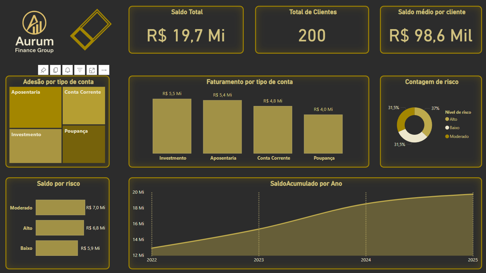

# Power-BI---Aurum-dashboard
Dashboard criado a partir de uma planilha dedados fictícios de uma empresa também fictícia para fins de enriquecimento de portfólio.
O gráfico interativo foi feito seguindo a identidade visual e paleta de cores da empresa. O dashboard é composto da análise de dados do grupo financeiro baseado em tipo de conta, faturamento por tipo de conta, contagem de risco, saldo por nível de risco e o saldo acumulado por ano. Além dessas informações, há a logomarca da empresa e 3 cartões exibindo respectivamente o saldo total, total de cliente e o saldo médio por cliente. 

Aqui está uma prévia do dashboard:

Vamos ver ele em ação?

